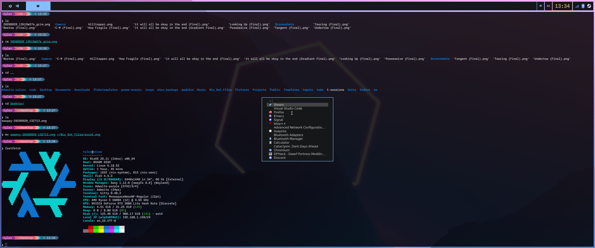

# Nix_Dot_Files
I am likely going to regret this. 

## Table of Contents
- [README](README.md)
- [About](./docs/about.md)
- [ToDo](./docs/todo.md)
- [Sway](./docs/sway.md)
---
## Use Case
I have long wanted to experiment with different workflows in Linux. The problem with experimentation is obvious: dependencies, configurations, and general clutter from software you no longer use pile up the more you experiment. Enter Nix, which, for the sake of this discussion, can function almost atomically.

This project aims to provide a modular, relatively unopinionated starting point where individual components can be enabled, disabled, replaced, or extended without committing to a particular desktop environment, editor, shell, or workflow.

The goal is to make it easier to try a different workflow without starting from scratch or inheriting incompatible configuration. That was the position I found myself in when I started learning NixOS, and hopefully this can serve the same purpose for others. 

> **Warning:** This is primarily my goal, not a claim that this project is ready to be installed as a complete system, especially by beginners. It is still a work in progress and reflects my own experimentation with NixOS. It wasn't until I saw how easily Nix could be used to build a custom environment brick by brick that I realized how powerful it is as a tool for experimentation.

## Screenshots


## Wallpaper Credit

Madison has made some of my favorite wallpapers to use, many of which I have used for years now. 

**[Positron Dream](https://www.positrondream.com/about)**

**[Madison's Reddit](https://www.reddit.com/user/Madisor_)**

## Layout
To understand my thinking with this layout, I wanted apps that most people need to have a working PC to be handled system wide while user specific software and configs were handled with home-manager.

```text
Nix_Dotfiles/
│
├── flake.nix
├── flake.lock
│
├── hosts/
│   ├── desktop/
│   │   ├── default.nix
│   │   └── hardware-configuration.nix
│   │
│   ├── laptop/
│   │   ├── default.nix
│   │   └── hardware-configuration.nix
│   │
│   └── generic/
│       ├── default.nix
│       └── hardware-configuration.nix
│
├── modules/
│   ├── default.nix
│   │
│   ├── system/
│   │   ├── system.nix
│   │   ├── boot.nix
│   │   ├── fonts.nix
│   │   ├── locale.nix
│   │   ├── networking.nix
│   │   └── security.nix
│   │
│   ├── audio/
│   │   └── audio.nix
│   │
│   ├── dm/
│   │   ├── gdm.nix
│   │   ├── greetd.nix
│   │   ├── ly.nix
│   │   └── sddm.nix
│   │
│   ├── graphics/
│   │   └── nvidia.nix
│   │
│   ├── de/
│   │   ├── gnome.nix
│   │   ├── hyprland.nix
│   │   ├── niri.nix
│   │   └── sway.nix
│   │
│   ├── packages/
│   │   ├── packages.nix
│   │   └── gaming.nix
│   │
│   └── users/
│       └── tyler.nix
│
├── home-manager/
│   ├── default.nix
│   ├── packages.nix
│   ├── firefox.nix
│   ├── fish.nix
│   ├── zsh.nix
│   ├── fuzzel.nix
│   ├── git.nix
│   ├── kitty.nix
│   ├── nvim.nix
│   ├── helix.nix
│   ├── starship.nix
│   ├── vscode.nix
│   │
│   ├── sway/
│   │   ├── sway.nix
│   │   └── waybar.nix
│   │
│   ├── hyprland/
│   │   └── hyprland.nix
│   │
│   └── niri/
│       └── niri.nix
│
├── home/
│   └── .config/
│       ├── Code/
│       │   └── User/
│       │       └── settings.json
│       │
│       ├── kitty/
│       │   ├── kitty.conf
│       │   └── themes/
│       │       └── *.conf
│       │
│       ├── fuzzel/
│       │   └── fuzzel.init
|       |
│       ├── sway/
│       │   └── config
│       │
│       ├── waybar/
│       │   └── style.css
│       │
│       ├── nvim/
│       │   ├── init.lua
│       │   ├── nvim-pack-lock.json
│       │   ├── .stylua.toml
│       │   ├── lua/
│       │   │   ├── custom/
│       │   │   │   └── plugins/
│       │   │   │       └── init.lua
│       │   │   └── kickstart/
│       │   │       ├── health.lua
│       │   │       └── plugins/
│       │   │           ├── autopairs.lua
│       │   │           ├── debug.lua
│       │   │           ├── indent_line.lua
│       │   │           ├── lint.lua
│       │   │           └── neo-tree.lua
│       │   └── .gitignore
│       │
│       └── starship.toml
│
├── scripts/
│   ├── rebuild.sh
│   ├── upgrade.sh
│   ├── editglobalconf.sh
│   └── trash.sh
│
├── docs/
│   └── sway.md
│
├── imperative/
│   ├── Setup_Example
│   ├── What.md
│   └── Why.md
│
│
├── README.md
├── About.md
├── ToDo.md
├── LICENSE
└── .gitignore
```
**The Above Structure is a Work In Progress**
## Structure

### Separation of Responsibilities

| Directory | Purpose |
|---|---|
| `hosts/` | Things that differ between machines |
| `modules/` | Reusable NixOS system configuration |
| `home-manager/` | Home Manager declarations and user-level configuration |
| `home/` | Actual application configuration files |
| `scripts/` | Convenience/maintenance scripts |
| `imperative/` | Non-declarative setup material and documentation |
| `deprecated/` | Previous approaches retained for reference |

### Configuration flow

```text
flake.nix
    │
    ├── hosts/<machine>/
    │       └── hardware-configuration.nix
    │
    ├── modules/
    │       ├── system/
    │       ├── networking/
    │       ├── audio/
    │       ├── nvidia/
    │       ├── de/
    │       └── ...
    │
    └── home-manager/
            │
            ├── packages.nix
            ├── git.nix
            ├── nvim.nix
            ├── kitty.nix
            ├── vscode.nix
            └── ...
                    │
                    ▼
                  home/
                    └── .config/
                          ├── nvim/
                          ├── kitty/
                          ├── Code/
                          └── starship.toml
```
For most situations, home manager having a nix file that points to a config file is the easiest way I have found to avoid my fighting with NixOS. 